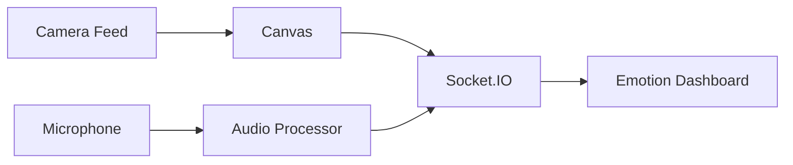

# EmotionScan Frontend


Real-time emotion detection web interface.

## Features
- Live webcam feed processing
- 5-second voice recording
- Dual emotion visualization:
  - Facial expression analysis
  - Speech emotion detection
- Responsive UI with animated indicators

## Installation
1. **Clone the Repository**
```bash
git clone https://github.com/VinamraSaurav/emotion-recognition-frontend.git
cd emotion-recognition-frontend
```

2. **Install Dependencies**
```bash
npm install
# or
yarn install
```

## Configuration
Create `.env.local`:
```ini
NEXT_PUBLIC_SOCKET_URL=http://localhost:5000
NEXT_PUBLIC_AUTO_RECORD_DURATION=5000  # 5s recordings
```

## Running the App
```bash
npm run dev
# or
yarn dev
```
App runs at `http://localhost:3000`

## UI Components


## Key Technologies
- **Media Processing**:
  - `navigator.mediaDevices` API
  - Web Audio Context
- **Visualization**:
  - SVG circular progress
  - Emotion emoji mapping
- **State Management**:
  - React hooks
  - Socket.IO events

## Environment Variables
| Variable | Default | Purpose |
|----------|---------|---------|
| `NEXT_PUBLIC_SOCKET_URL` | `localhost:5000` | Backend WS URL |
| `NEXT_PUBLIC_AUTO_RECORD_DURATION` | 5000 | Recording length (ms) |

## Browser Support
| Browser | Minimum Version |
|---------|-----------------|
| Chrome | 58+ |
| Firefox | 55+ |
| Edge | 16+ |
| Safari | 11.1+ |

